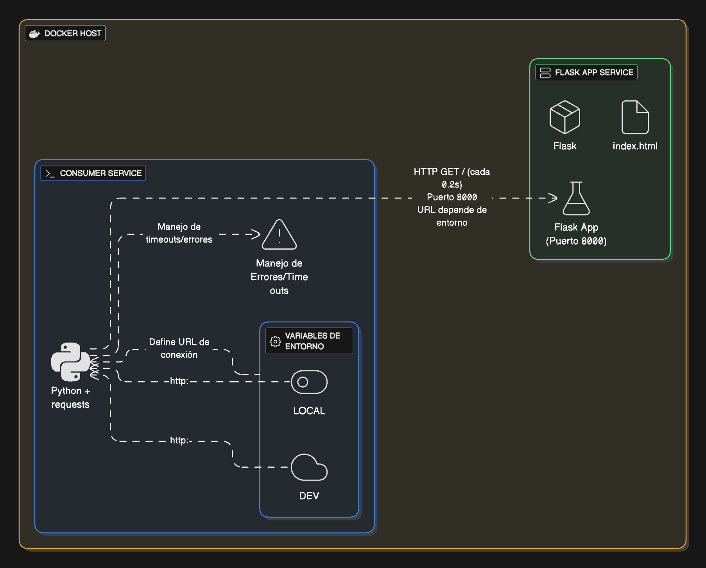

# devops-services-flask

<p align="left">
  
  
  
  
</p>



## Descripción

**devops-services-flask** es una solución compuesta por dos servicios principales:

- **Flask App**: API web desarrollada en Python con Flask, optimizada para despliegue en Docker y Kubernetes.
- **Consumer**: Servicio Python que consume la API Flask, monitorea su estado y reporta estadísticas.

El objetivo es demostrar buenas prácticas DevOps, integración entre servicios, monitoreo y despliegue moderno.

---

## Estructura del Proyecto

```
devops-services-flask/
│
├── app/                # Servicio principal Flask
│   ├── app.py          # Código fuente de la API Flask
│   ├── requirements.txt# Dependencias de Flask
│   └── templates/
│       └── index.html  # Template principal
│
├── consumer/           # Servicio consumidor
│   ├── consumer.py     # Código fuente del consumer
│   └── requirements.txt# Dependencias del consumer
│
└── docs/
    └── roxs-diagrama.png # Diagrama de arquitectura
```

---

## Instalación

### Requisitos

- Python 3.12+
- Docker (opcional, recomendado para despliegue)
- pip

### Instalación Manual

1. Clona el repositorio:
   ```bash
   git clone https://github.com/roxsross/devops-services-flask.git
   cd devops-services-flask
   ```

2. Instala dependencias de Flask:
   ```bash
   cd app
   pip install -r requirements.txt
   ```

3. Instala dependencias del consumer:
   ```bash
   cd ../consumer
   pip install -r requirements.txt
   ```

### Despliegue con Docker

Puedes crear tus propios Dockerfiles para ambos servicios o integrarlos en un `docker-compose.yml` para levantar todo el stack.

---

## Uso

### Ejecutar Flask App

```bash
cd app
python app.py
```

Por defecto, la API corre en `http://0.0.0.0:8000`.

### Ejecutar Consumer

```bash
cd consumer
python consumer.py
```

El consumer intentará conectarse a la API Flask y reportará el estado en consola.

---

## Endpoints Principales

- `/`  
  Página principal con información del sistema y estado del consumer.

- `/health`  
  Health check para Docker/Kubernetes. Actualiza el estado del consumer.

- `/api/consumer-heartbeat`  
  Endpoint para registrar actividad del consumer (POST/GET).

- `/api/info`  
  Información del sistema, app y estado del consumer.

- `/api/consumer/status`  
  Estado detallado del consumer.

- `/api/consumer/simulate-error`  
  Simula un error en el consumer (testing).

---

## Configuración

### Variables de Entorno (Flask App)

- `SECRET_KEY`: Clave secreta para Flask.
- `PORT`: Puerto de escucha (default: 8000).
- `FLASK_DEBUG`: Activa modo debug (`1` para ON).
- `FLASK_ENV`: Entorno de ejecución (`production`, `development`, etc).

### Variables de Entorno (Consumer)

- `API_URL`: URL de la API Flask (default: `http://flask-app:8000`).
- `CONSUMER_DELAY`: Intervalo entre chequeos (segundos, default: `2`).
- `DEBUG_MODE`: Modo debug (`1` para ON).
- `SIMULATE_FAILURE`: Simula fallo del consumer (`1` para ON).

---

## Arquitectura

El sistema está pensado para ejecutarse en contenedores Docker y ser orquestado en Kubernetes. El diagrama en `docs/roxs-diagrama.png` ilustra la interacción entre los servicios.

- El **Consumer** realiza peticiones periódicas a la API Flask.
- La API Flask actualiza el estado del consumer y expone endpoints para monitoreo.
- El frontend (template HTML) muestra el estado en tiempo real y permite simular errores.

---

## Personalización y Extensión

Puedes modificar los templates, agregar endpoints, integrar bases de datos o sistemas de monitoreo según tus necesidades.

---

## Despliegue en Kubernetes

Este proyecto incluye manifiestos para desplegar los servicios en un clúster Kubernetes. Los archivos se encuentran en la carpeta `kubernetes/`:

- `app.yaml`: Deployment para el servicio principal Flask.
- `app-service.yaml`: Service para exponer el API Flask dentro del clúster.
- `consumer.yaml`: Deployment para el servicio consumidor.
- `ingress.yaml`: Ingress para enrutar tráfico HTTP al servicio Flask.

### Ejemplo de despliegue

1. Aplica los manifiestos en el orden recomendado:
   ```bash
   kubectl apply -f kubernetes/app.yaml
   kubectl apply -f kubernetes/app-service.yaml
   kubectl apply -f kubernetes/consumer.yaml
   kubectl apply -f kubernetes/ingress.yaml
   ```

2. Verifica los recursos:
   ```bash
   kubectl get pods
   kubectl get services
   kubectl get ingress
   ```

3. Accede a la aplicación a través del endpoint definido en el Ingress (según configuración de tu clúster).

#### Variables de entorno principales

Los deployments incluyen variables como:

- `API_URL`: URL interna para comunicación entre servicios.
- `FLASK_DEBUG`, `PYTHONUNBUFFERED`, `CONSUMER_DELAY`: Configuración de debug y comportamiento.

Puedes personalizar los valores editando los archivos YAML antes de desplegar.

---
## Despliegue con Docker Compose

Este proyecto incluye varios archivos para levantar los servicios con Docker Compose:

- `compose.yml`: Despliegue básico de los servicios Flask y Consumer.
- `compose.nginx.proxy.yml`: Añade un proxy Nginx para enrutar tráfico HTTP.
- `compose.scale.yml`: Permite escalar los servicios fácilmente.

### Ejemplo de uso

1. Levanta los servicios básicos:
   ```bash
   docker compose -f compose.yml up -d
   ```

2. Para usar el proxy Nginx:
   ```bash
   docker compose -f compose.yml -f compose.nginx.proxy.yml up -d
   ```

3. Para escalar los servicios:
   ```bash
   docker compose -f compose.yml -f compose.scale.yml up -d
   ```

4. Verifica los contenedores:
   ```bash
   docker ps
   ```

Puedes combinar los archivos según tus necesidades usando la opción `-f` de Docker Compose.

---
## Créditos

Desarrollado por **roxsross** para el Challenge DevOps.

---